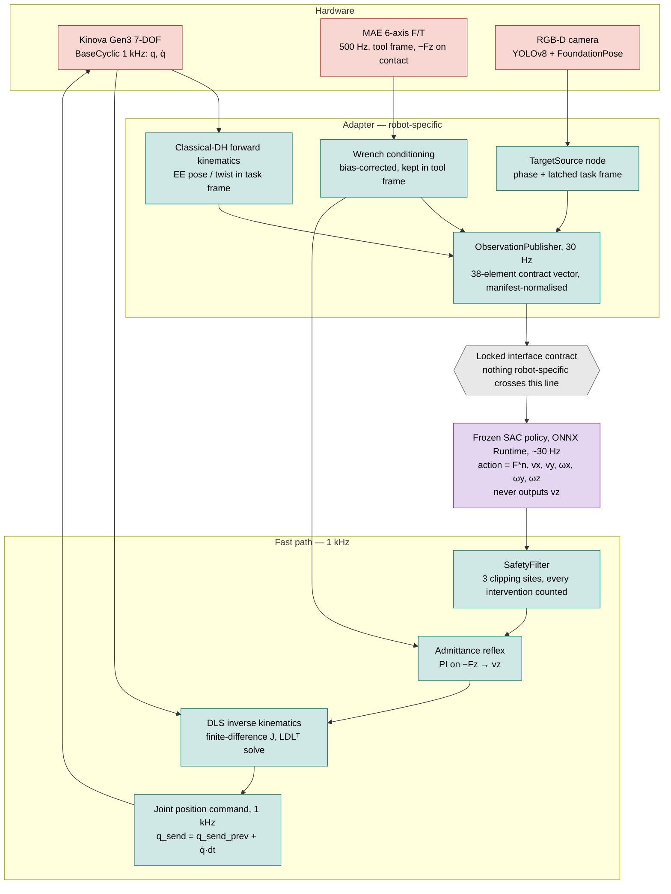
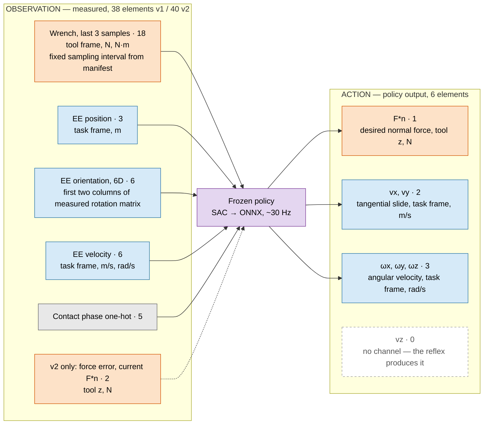
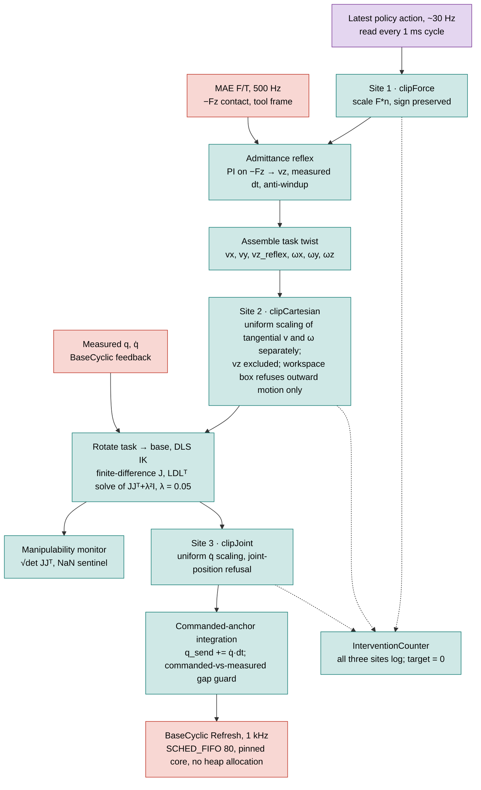
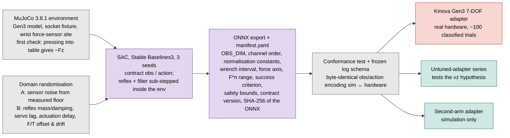
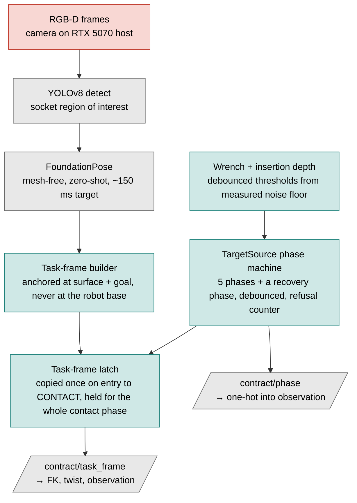

# Methodology

The system has three layers. Every component belongs to exactly one layer, and the layer decides what it is allowed to know.

| Layer | Runs at | Knows about the robot? | Contents |
|---|---|---|---|
| **Above the contract** | ~7–10 Hz | No | Perception (YOLOv8 + FoundationPose), task-frame builder, phase state machine (TargetSource) |
| **The contract — frozen policy** | ~30 Hz | **No — by construction** | SAC policy trained in MuJoCo, exported to ONNX, never modified after training |
| **Below the contract — adapter** | 1 kHz | Yes — everything robot-specific lives here | Safety filter, admittance reflex, damped-least-squares IK, forward kinematics, F/T sensor conditioning, Kinova low-level interface |

Colour key used in the diagrams: 🟥 hardware / sensors · 🟦 adapter (robot-specific, below the contract) · 🟪 policy side (portable bytes) · ⬜ infrastructure / offline.

---

## 1. System overview — sensors to joint command

Three sensors run at three rates: Gen3 joint feedback at 1 kHz (Kortex BaseCyclic), the MAE 6-axis F/T sensor at 500 Hz (contact reads as **negative Fz** in the tool frame), and RGB-D perception at roughly 7 Hz (~150 ms end-to-end target).

Two loops close: joint state and wrench return to the adapter at 1 kHz; the observation returns to the policy at 30 Hz. **Compliance comes from the reflex, not from the arm** — the Gen3 is driven through its position interface in this project.

---

## 2. The locked interface contract — observation up, action down

**Hard axis partition.** The contact-normal axis is force-controlled; every other axis is motion-controlled. Commanding force *and* velocity on the same axis is not merely discouraged — it is unrepresentable, because vz has no channel.

**Excluded on purpose:** joint angles, joint velocities, joint torques, motor currents, manipulability. All are robot-specific and live below the contract. Their absence is what lets the same policy bytes run on a different kinematic chain.

**Orientation** is observed as the first two columns of the measured rotation matrix. Because the action's orientation channels are angular velocities, no rotation is ever reconstructed from it and no orthogonalisation step exists anywhere in the loop.

**Versions.** v1 (38 elements) fixes the desired force to a manifest constant — the adapter overrides F*n. v2 (40 elements) lets the policy command F*n. The action is 6 elements in both.

---

## 3. The 1 kHz adapter loop — one policy action, from policy to arm

**Why the design looks like this**

- **Uniform scaling, not per-joint clipping** at Site 3: clipping joints individually would rotate the Cartesian direction of motion. Scaling the whole vector preserves it.
- **vz excluded from Site 2** so that the force-controlled axis has exactly one limiter (the reflex's own clamp), not two in series.
- **Commanded-anchor integration** (`q_send = q_send_prev + q̇·dt`): anchoring the command to the *measured* position instead leaked 96.5 % of the commanded amplitude on hardware. This was diagnosed as an interface-semantics error, not a gain problem.
- **Manipulability monitor**: below threshold → abort-and-retract in contact, joint-space fallback in free space. The all-zero joint configuration is a rank-3 singularity and is never used as a start pose.

**Measured on hardware / lab PC (as of September 2026)**

| Quantity | Value |
|---|---|
| DLS IK execution time (N = 10⁶, RelWithDebInfo) | mean 1.88 µs · p99.9 2.98 µs · budget 1000 µs |
| Safety filter execution time (four scenarios) | worst p99.9 ≤ 40 ns |
| 1 kHz cycle-time jitter, SCHED_FIFO + core pinning | stddev 284 µs → 2.3 µs, zero deadline misses |
| Servo model, joint 7 only (first-order fit) | gain ≈ 64 /s, time constant ≈ 16 ms (order of magnitude only) |
| Existing 13 Hz force controller (surface wiping) | holds ≈ 5 N within ±0.5 N |

---

## 4. Offline training and the portability claim

**Group B randomisation is what carries the portability claim.** Randomising only the environment (stiffness, friction, socket pose) would produce a policy robust to the task and fragile to the arm — the opposite of what is wanted.

**Same code path in simulation.** The reflex and the safety filter run *inside* the environment, sub-stepped at their real rate, not once per policy step. A conformance test checks that observation and action encodings are byte-identical between simulation and hardware before the policy is allowed to run.

**The working hypothesis.** Descent rate along the contact normal is the action channel most tightly coupled to arm mass, joint friction and servo bandwidth. Removing it from the action space (the reflex owns vz) is what is expected to let the skill cross bodies. This is a hypothesis; the untuned-adapter series is the measurement that tests it.

**Porting procedure (five steps per new body):** implement FK and differential IK for the new chain → define the task frame → re-tune admittance mass and damping → calibrate the F/T mounting and confirm the sign convention → set the safety bounds. Normalisation constants are explicitly *not* re-tuned; they are copied from the manifest unchanged. Person-hours per port are logged as a reported metric.

---

## 5. Perception, phase machine and the task-frame latch

**Why the latch exists.** Perception jitters at roughly 7–10 Hz. Without the latch that jitter shows up in the observation as oscillation in the task-frame pose and velocity channels and — more damagingly — rotates the commanded tangential slide direction, so the search pattern chases the *frame* instead of the *socket*.

**Perception sits above the contract** and its only output is the task frame. Any 6-DOF pose source of comparable accuracy can be substituted on a new arm without touching the policy. Measured perception accuracy sets the initial pose-error range used in training.

**Known limitation.** The latch forbids updating the frame mid-contact, so curved-surface tasks (polishing, medical scanning) are out of scope and named as follow-on work.

---

## 6. Experimental plan (summary)

- **Task:** multi-pin connector insertion at sub-millimetre clearance. Success = full seating depth (from a hand-guided reference insertion) within tolerance, held for 1 s, within a per-trial time limit, with no safety abort. The criterion is geometric so it scores identically in simulation and on hardware; electrical continuity is a secondary check. Part, clearance, tolerance and time limit are fixed in the manifest before the first reported run.
- **Primary figure:** insertion success rate (with Wilson interval) vs. robot body, real Gen3 leftmost. Three series — frozen policy with tuned adapter, frozen policy with untuned adapter, baseline retrained per body — the frozen series reported with and without adapter-side residual adaptation. Simulated and real bodies drawn with distinct markers.
- **Baselines:** position-only policy with passive compliance; hand-tuned PI force control (the existing wipe controller re-tuned, with re-tuning effort reported); same policy with safety filter removed; high-rate baseline (same architecture at reflex rate, no separate fast layer).
- **Ablations:** remove force from the observation; remove the reflex; remove the safety filter; remove residual adaptation; sweep policy rate.
- **Rigor:** ≥100 hardware trials per condition that carries the primary claim (≥200 in simulation) — set by the ±15-point margin, not by convention; exploratory variants use 20 and are reported as intervals. Failures classified (missed entry, jam, stagnation, safety abort, timeout), not just counted. ≥3 seeds per policy, spread reported.
